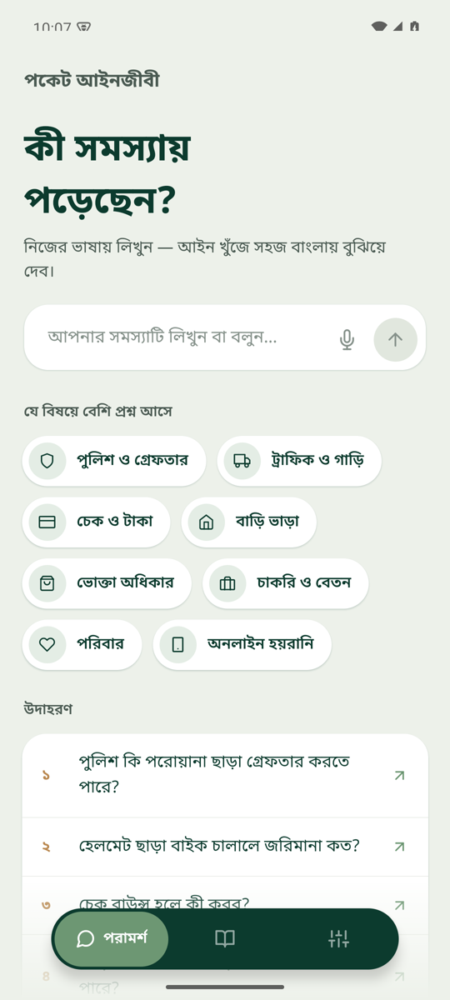
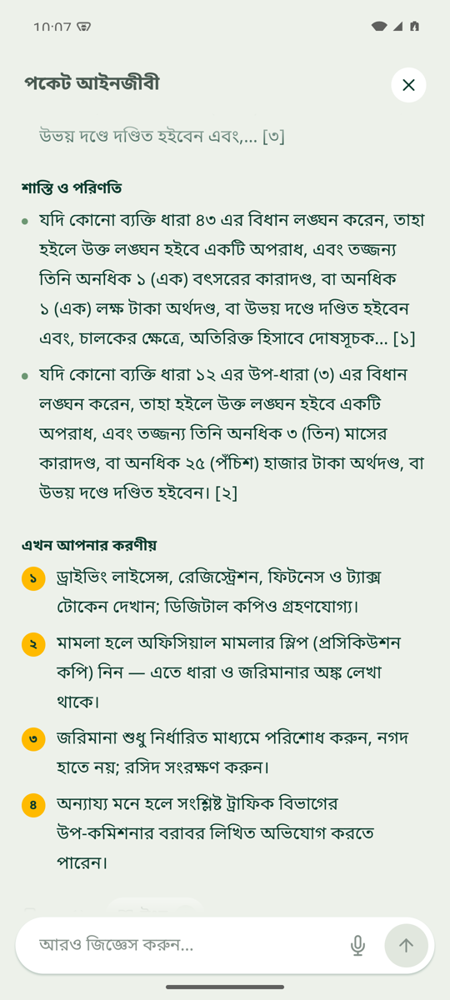
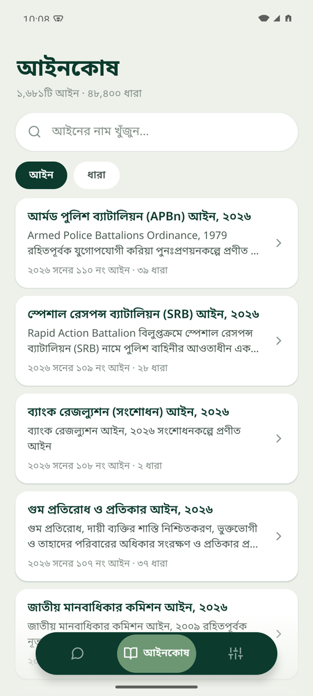
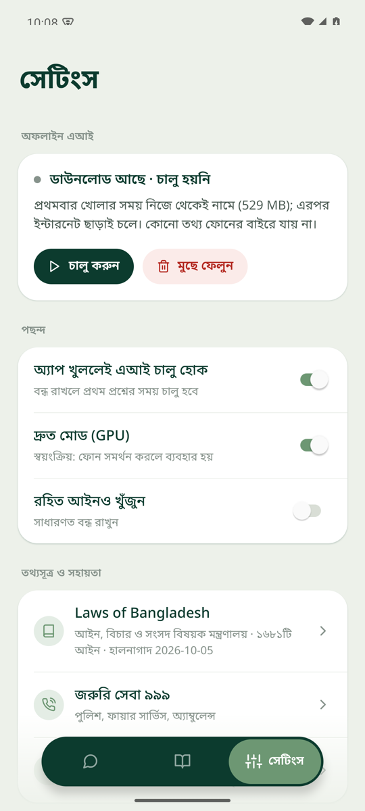

# Pocket Lawyer (পকেট আইনজীবী)

An offline legal assistant for Bangladesh. Describe your problem in Bangla, Banglish or English. The app finds the relevant sections of Bangladeshi law and explains them in simple Bangla, with citations. Everything runs on the phone, with no internet required.

<p align="center">
  
  
  
  
</p>

## Features

- **Ask in your own words**: type or speak (voice input) and get a plain-Bangla answer that cites the exact sections, plus practical next steps.
- **Full law library (আইনকোষ)**: 1,681 acts and 48,400 sections from the official [Laws of Bangladesh](http://bdlaws.minlaw.gov.bd) database, searchable by act or section.
- **On-device AI**: a Google Gemma 3 1B model (MediaPipe LLM Inference) runs locally. It is a one-time ~529 MB download, and no data leaves the phone.
- **Works without the model too**: the app falls back to showing the matching law sections directly.
- Copy and read-aloud (text-to-speech) for answers, plus a 999 emergency shortcut.

## Tech stack

Expo (SDK 57) · Expo Router · TypeScript · SQLite + FTS5 · a custom Kotlin Expo module (`modules/gemma-llm`) for MediaPipe.

## Getting started

```bash
npm install
npx expo prebuild --platform android --clean
npx expo run:android      # Expo Go can't load the native AI module
```

Rebuild the law database (optional):

```bash
npm run data:scrape       # download acts from bdlaws.minlaw.gov.bd
npm run data:build        # build assets/db/bdlaws.db
```

## Disclaimer

Pocket Lawyer gives general legal information, not legal advice. For serious matters, consult a qualified lawyer.
